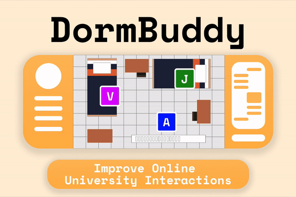

# DormBuddies

## A web app to help current and prospective university students in building life-long friends.

With the way university is structured right now in its virtual setting, it is hard to connect with others from your university. This is especially true for students who are starting university this year. So how do student make friends? What is the best possible way to connect with other students? Through our personal experiences we have found that living in a dorm with other students is a great way in making friends that you will be with throughout university and beyond. DormBuddies tries to simulate the dorm experience virtually to connect people in a virtual world.

## How does it work?
DormBuddies is a web application that allows users to create an account and be matched with others from the same school. The app matches people with similar intrests, who go to the same school and puts them in 'dorms', where they can interact using the interactive map or video chat. This way, the group have a place to interact throughout the school year and connect with each other. The website can be accessed [here](https://dormbuddy.herokuapp.com/index).

## How is it built?
The video chat servers are build with Node and hosted on Heroku, while the UI and Firebase integration is done with typescript, vue, bootstrap and bulma.

## Want to run it locally?
Just run `npm install` in the project root, which will install all dependancies. Then call `npm start` and `node app.js` to start both required servers. 
